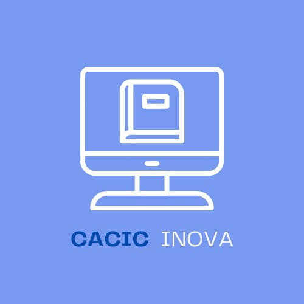

  

<h3 align="center">Bot do Discord do COLCIC</h3>

---

 🤖 Bot gerenciador do servidor no discord de Ciência da Computação da UESC
      

## 📝 Table of Contents

-   [📝 Table of Contents](#-table-of-contents)
-   [🚀 Deploying your own bot](#-deploying-your-own-bot)
-   [⛏️ Built Using](#️-built-using)
-   [✍️ Authors](#️-authors)
-   [🎉 Acknowledgements](#-acknowledgements)

---

## 🚀 Deploying your own bot

Serviço de hospedagem:

-   [DisCloud](https://discloudbot.com/)

## ⛏️ Built Using

-   [DiscordJS](https://discord.js.org/#/)

## ✍️ Authors

-   [@igorroc](https://github.com/igorroc) - Idea & Initial work

See also the list of [contributors](https://github.com/igorroc/cacic_bot/contributors) who participated in this project.

## 🎉 Acknowledgements

-   Hat tip to anyone whose code was used
-   Inspiration
-   References
